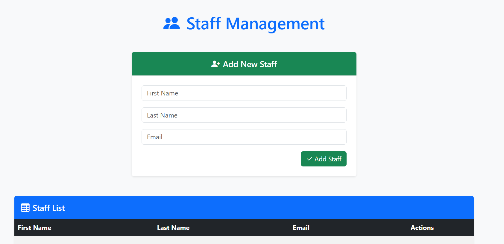
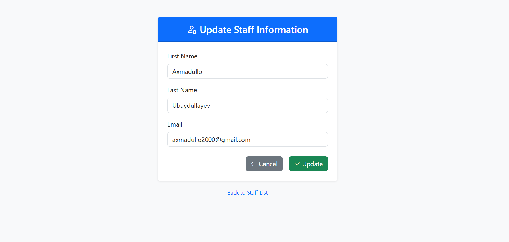

Markdown# 🌟 Staff Management CRUD App

[](https://openjdk.org/)
[](https://spring.io/projects/spring-framework)
[](https://www.thymeleaf.org/)
[](https://getbootstrap.com/)
[](https://maven.apache.org/)
[](https://opensource.org/licenses/MIT)

Простое и элегантное **CRUD-приложение** для управления сотрудниками. Построено на **чистом Spring MVC** (без Spring Boot), с серверным рендерингом через **Thymeleaf** и красивым интерфейсом на **Bootstrap 5**.

Идеально для изучения классического Spring MVC или как база для enterprise-проектов!

## 🚀 Возможности

- ➕ Добавление новых сотрудников
- 👀 Просмотр списка в responsive таблице
- ✏️ Редактирование данных
- 🗑️ Удаление с подтверждением
- 📱 Адаптивный дизайн (мобильные устройства)
- 💾 In-memory хранилище (легко заменить на БД)

## 📸 Скриншоты


*Список сотрудников + форма добавления*


*Чистая форма редактирования*

*(Добавьте реальные скриншоты в папку `screenshots/` для максимального эффекта!)*

## 🛠️ Технологии

| Технология       | Версия    | Описание                          |
|------------------|-----------|-----------------------------------|
| Java             | 17        | Основной язык                     |
| Spring Framework | 6.0+     | MVC, Context                      |
| Thymeleaf        | 3.1.3    | Шаблоны HTML                      |
| Bootstrap 5      | CDN      | Стили и responsive дизайн         |
| Lombok           | 1.18+    | Уменьшение boilerplate            |
| Maven            | 3.8+     | Сборка и зависимости              |

## 📦 Установка и запуск

### Требования
- Java 17+
- Maven 3.8+
- Apache Tomcat 10+ (Jakarta EE 9+)

### Шаги
1. **Соберите WAR-файл**
   ```bash
   mvn clean package
→ Получите target/CRUD.war

Разверните на Tomcat
Скопируйте CRUD.war в webapps/ Tomcat
Запустите Tomcat:Bashcd /path/to/tomcat/bin
./startup.sh  # или startup.bat на Windows

Откройте приложение
→ http://localhost:8080/CRUD/

🔮 Будущие улучшения

Подключить Spring Data JPA + H2/MySQL
Добавить валидацию форм (@Valid)
Интегрировать Spring Security
Перейти на Spring Boot для embedded сервера

🤝 Вклад в проект
Любые pull request'ы приветствуются! Форкните, создайте ветку и отправьте PR.
📄 Лицензия
MIT License — используйте свободно!

⭐ Понравилось? Поставьте звезду! ⭐
Сделано с ❤️ для изучения Spring MVC
